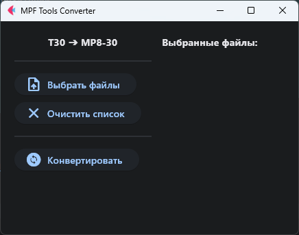
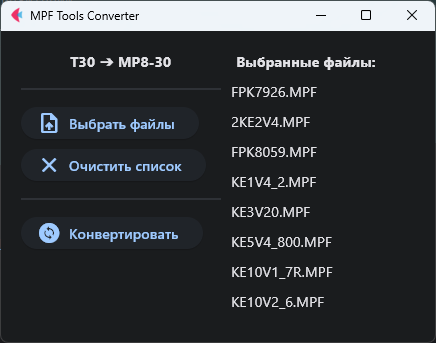
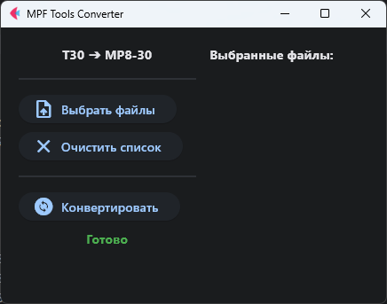
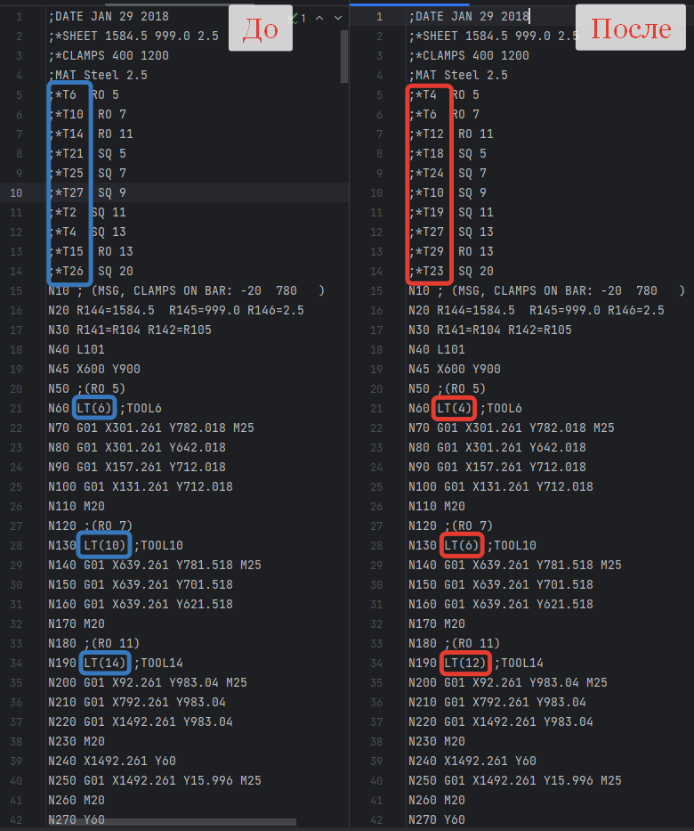

# MPF Tools Converter

## Описание:

Программа пакетной обработки MPF-файлов(файлы для станков с ЧПУ) с заменой определённых значений согласно таблице замены.

## Возможности:
- Получение таблицы замены из CSV-файла.
- Возможность выбора одного или нескольких файлов для обработки.
- Очистка списка файлов после конвертации или по желанию пользователя.

## Используемые библиотеки:
- `flet`
- `PyYAML`
- `csv`

## Запуск:
```bash
# 1. Клонировать репозиторий:
git clone https://github.com/proDreams/mpf_tools_converter.git
# 2. Установить зависимости:
pip install -r requirements.txt
# 3. Запустить приложение:
python main.py

# Или скачать portable-версию из раздела Releases
```

## Автор:
[Иван "proDream" Ашихмин](https://github.com/proDreams)

## Скриншоты:
  
Окно программы.

  
Окно программы с выбранными файлами.

  
Сообщение о завершении работы.

  
Результат работы программы.
